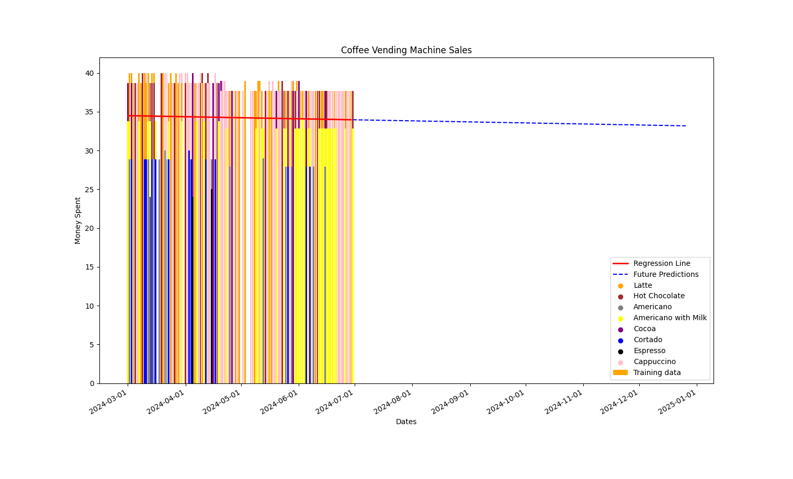

```{r setup, include = FALSE}
knitr::opts_chunk$set(echo = FALSE, message = FALSE, 
  warning = FALSE, error = FALSE, cache = FALSE)
```

```{r load-packages, include = FALSE}
# packages
library(knitr)
# library(tidyverse)
```

# ML Cheatsheet For Linear Regression

\begin{blackbox}{What is a Linear Regression Model?}

A linear regression model is one of the simplest examples of machine learning (ML) that can be used to predict data. A linear regression model focuses on using at least one key piece of data in order to predict another. Using just one type of data to make such predictions is known as a "Simple Linear Regression Model". However, if more than one data point needs to be used to make a prediction, this is called a "Multiple Linear Regression Model". The use case depends on what the goal is for the prediction and requires some level of understanding for the dataset in question by way of data exploration.

|

*Multiple vs. Simple Linear Regression Model:*

|

A simple linear regression model uses one data point (independent variable) to predict and calculate the wanted result (dependent variable). A multiple linear regression model uses more than one independent variable to accomplish this.
\end{blackbox}


### Key Area for Building A Linear Regression Model:

In order to properly build a linear regression model, we need to understand the steps involved.

\begin{bluebox}{Step 1: Importing The Relevant Libraries:}

In this case of Python, you'll need to make sure you import the libraries relevant to your project. In general, you can create a linear regression model with the following libraries listed below. This can vary depending on the language and objectives. For example, you may not need to necessarily create plots to visualize the data despite it being generally useful, so you can exclude matplotlib if that's the case.:

* numpy
|
* sckit-learn
|
* pandas
|
* matplotlib
|
* pylab (optional)

\end{bluebox}

```{python, import_libs, echo=show}
# import numpy as np
# import pandas as pd
# import matplotlib.pyplot as plt
# from sklearn import linear_model
```


\begin{redbox}{Step 2: Loading the Dataset:}

Once the necessary libraries have been imported, the dataset needs to be loaded in. Assuming the library is already present locally on the machine, you can load the data using pandas or other libraries. In this example, we use pandas do accomplish this as shown below.:
\end{redbox}

```{python, dataset_loading, echo=show}
# dataset = pd.read_csv("PATH\\TO\\YOUR\\DATASET.csv")
```

\begin{greenbox}{Step 3: Data Exploration:}

This steps requires understanding what the dataset consists of and figuring out what data can be used to accomplish the goal. The following are some basic example of how we can understand the dataset in further detail by viewing the data in various different ways.
\end{greenbox}

```{python, data_exploration, echo=show}
# dataset.head(9)  
# ^ This will show the first 10 rows of data from the dataset.

# dataset.tail(9)
# ^ This will show the last 10 rows of data from the dataset.

# dataset.describe()
# ^ This will provide a quick summary of the central tendency, dispersion 
# and shape of a dataset's distribution excluding 'NaN' values by default
```

\begin{greenbox}

Additionally, the data can also be explored by visualization leveraging some libraries like matplotlib or ggplot which is very popular with R programming. The following example shows how we can select specific columns of data from a non-existent dataset and plot them using matplotlib.:
\end{greenbox}

```{python, data_exporation2, echo=show}
# visualization = dataset[['ENGINE_SIZE', 'CYINDERS', 'CO2EMISSION']] 
# ^ This creates a variable and assigns it to specific columns from the "dataset".
# plt.scatter(visualization)
# ^ Here, we select the type of plot which in this example is a scatter plot.
# plt.xlabel('Engine Size')
# ^ Here, we label the Y axis
# plt.ylabel('Test label')
# ^ Here, we label the X axis
# plt.legend()
# ^ Here, we create a legend for the plot.
# plt.title("Example Title")
# ^ Here, we create a title for the plot
# plt.show()
# ^ Finally, this executes all aforementioned plt lines and generates the plot
```


\begin{yellowbox}{Step 4: Selecting Features And The Target:}

Once we've identified the data we need and have determined the type of linear regression model to use, we can then create variables and assign them to the data we will be leveraging. Here is what an example would look like.:
*Note: This is essentially what I showed in the previous step on how to extract data from a dataset and assign it to the visualization variable. The difference is that here, we would know what data is needed to begin to work on the ML model.*

\end{yellowbox}

```{python, target_data, echo=show}
# X = data[['feature_column_name']].values
# y  = data['target_column_name'].values
```

\begin{bluebox}{Step 5: Splitting The Data:}

In this step, we need to create a "TEST" and a "TRAINING" set out of the dataset. The idea is to use out of sample testing which means the model will be trained on the training set but tested with the test set. This way we can properly train the model on the majority of data and then use the separate data not yet seen by the model to conduct a test and obtain accurate results from the trained model. For this example, we can use the numpy library to accomplish this.:

\end{bluebox}

```{python, data_splitting, echo=show}
# msk = np.random.rand(len(df)) < 0.8
# ^ Here, we use 0.8 out of 1.0 which means 80% of the dataset will 
# be for the msk variable for the training set below.:

# train = visualization[msk]
# test = visualization[~msk]
# ^ Here, the remaining 20% (denoted by the '~' symbol) 
# will be used for the testing set.
```


\begin{greenbox}{Step 6: Creating The Linear Regression Model:}

Next, we create the linear regression models using the sckit-learn library. We can do this with the following.:

\end{greenbox}

```{python, linear_reg_model, echo=show}
# regression_model = linear_model.LinearRegression()
# train_x = np.asanarray(visualize[['ENGINESIZE']])
# ^ Note, the "visualization" variable was defined earlier and contains all data 
# relevant for this prediction.

# train_y = np.asanarray(visualize[['CO2EMISSION']])
# ^ We use numpy (np) to create an array (similar to how pytorch uses tensors) 
# for the model to understand the data.

# regression_model.fit(train_x, train_y)

# Finally, we want to print out the coefficients and intercept values of the 
# line to be generated.:

# print("Coefficients: ", regression_model.coef_)
# print("Intercept: ", regression_model.intercept_)
```


\begin{redbox}{Step 7: Making The Prediction:}

Next, now that we've trained the model with the training set, we can now make the actual predictions using the testing set. Here is an example of how we can accomplish this which is very similar to what we did previously for the training set except we pass the testing set along and make the prediction with the "predict" function as shown below.:

\end{redbox}

```{python, predictions, echo=show}
# test_x = np.asanarray(visualize[['ENGINESIZE']])
# test_y = np.asanarray(visualize[['CO2EMISSION']])

# test_pred = regression_model.predict(test_x)
# ^ Here, we allow the model to make the prediction.
```


\begin{greenbox}{Step 8: Evaluating The Model:}

For the evaluation of the model, we need to understand how accurate it is at predicting the needed values from the dataset. In order to do this, we need to calculate the mean absolute error rate (MAE). We can do so using the following code.:

\end{greenbox}

```{python, model_eval, echo=show}
# print("Mean absolute error: %.2f" % np.mean(np.absolute(test_pred - test_y)))
# print("Residual sum of squares (MSE): %.2f" % np.mean((test_pred - test_y) ** 2))
# print("R2-score: %.2f" % r2_score(test_y , test_pred) )
```

\newpage

\begin{yellowbox}{Step 9: Visualizing The Results:}

Finally, this is where we will want to visualize the results. This is where (at least for this example) matplotlib comes in. We import this as "plt" and we can then create out plot. Here is an example of how we can do this.:

|

*Note: Keep in mind that matplotlib has alot more to offer and you can select many different plot types to best visualize the data.*

\end{yellowbox}

```{python, vis_plot, echo=show}
# plt.scatter(test_x, test_y, color='red')
# plt.xlabel("test label for X")
# plt.ylabel("test label for Y")
# plt.title("Title for the Plot")
# plt.legend()
# plt.show()
# ^ This final line will execute the previous plt lines and generate our plot.
```

\newcolumn

\begin{blackbox}{Step 10: Visualization Of The Results:}

The following image is an example of a linear regression model that is designed to calculate or predict the amount of money spent on coffee over time. This illustrates what a final output can potentially look like when using matplotlib. For this example, the solid red line shows the average money spent using the already existing data from the dataset. The dotted blue line is the prediction calculated by the linear regression model for the remainder of year for 2024.

\end{blackbox}

```{r echo=FALSE, out.width="100%", fig.align="center"}

```
